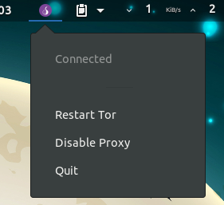
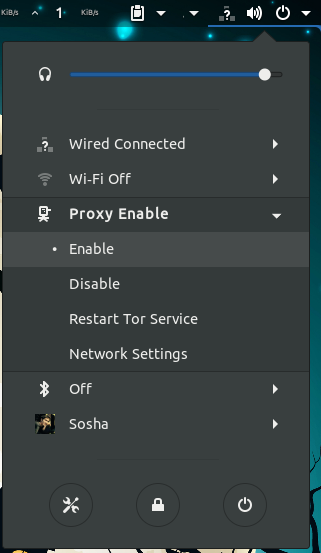

# Traktor V2.5
Traktor will autamically install Tor, privoxy, dnscrypt-proxy, resolvconf and Tor Browser Launcher in either a Debian based distro like Ubuntu, an Arch based distro, Fedora based distro or an OpenSUSE based distro and configures them as well.

To do this, just run 'installer.sh' file in a supported shell like bash and watch for prompts it asks you.

## Note
**Currently, Fedora and Arch aren't supported by Traktor.**

Do NOT expect anonymity using this method. Privoxy is an http proxy and can leak data. If you need anonymity or strong privacy, manually run torbrowser-launcher after installing traktor and use it.

### TODO
- [x] Dekstop Installer
    - [x] Indicator
    - [x] Support TorDNS
    - [x] Support OpenDNS
    - [x] Gnome Extension
    - [ ] Personal Package Archives (PPA)
- [x] Server Installer

### Support Distro
- [x] Desktop
    - [x] Ubuntu (16.04 | 17.10 | 18.04)
    - [x] Debian
    - [x] OpenSUSE
    - [x] Arch (not any more)
    - [x] Fedora (not any more)
- [x] Server
    - [x] Ubuntu
        - [x] Ubuntu Server Raspberry Pi (18.04)

### Support Dekstop
- [x] Gnome
- [x] Unity 7
- [x] XFCE
- [x] KDE
- [x] LXDE
- [x] Mate

### Support Bridge
- [x] obfs3
    - [ ] for Orbot
- [x] obfs4
    - [x] for [Orbot](https://gitlab.com/GNULand/TraktorPlus/Traktor/raw/config/orbot-obfs4-bridges)
- [ ] meek
    - [ ] for Orbot

## Manual Pages
[Traktor Manual Page](https://gitlab.com/GNULand/TraktorPlus/Traktor/wikis/Traktor-manual-page-(English)) {lang=EN}

[راهنمای اسکریپت تراکتور به زبان فارسی](https://gitlab.com/GNULand/TraktorPlus/Traktor/wikis/Traktor-manual-page-(persian)) {lang=FA}

## Install
```bash
$ sudo apt install net-tools
$ wget https://github.com/TraktorPlus/Traktor/archive/master.zip -O Traktor.zip
$ unzip Traktor.zip -d $HOME/Traktor && cd $HOME/Traktor/*
$ chmod +x installer.sh
$ ./installer.sh
```

### torrc Generator
New option for share Tor Proxy on your local Network. {see [Manual Pages](#manual-pages) for more Information}
```bash
$ chmod +x torrc-gen.py
$ ./torrc-gen.py
```
If you Like use this option on your Mobile or PC, type your Local IP Network instead `LocalIpMachine` in "Proxy Settings or Network Settings".

HTTP:
`LocalIpMachine:8181`

SOCKS:
`LocalIpMachine:9050`

> Example:

> My Local IP Network: 192.168.1.2

> for HTTP: `192.168.1.2:8181`

> for SOCKS: `192.168.1.2:9050`


### Other for Traktor Panel (Indicator)
[Traktor Panel:](https://gitlab.com/GNULand/TraktorPlus/Traktor-Panel)



1. Install the dependencies with your package manager. For instance, on Ubuntu:
```bash
$ sudo apt install curl
$ sudo apt install python-gi python-appindicator gir1.2-appindicator3-0.1
```

2. Clone the script repository and Run the script:
```bash
$ wget https://gitlab.com/GNULand/TraktorPlus/Traktor-Panel/repository/master/archive.zip -O Traktor-Panel.zip
$ unzip Traktor-Panel.zip -d $HOME/Traktor-Panel && cd $HOME/Traktor-Panel/*
$ chmod +x installer-panel.sh
$ ./installer-panel.sh
```

### Other for Traktor Extension (Gnome Extension)
[Traktor Extension:](https://gitlab.com/GNULand/TraktorPlus/Traktor-Gnome-Extension)


```bash
$ wget https://gitlab.com/GNULand/TraktorPlus/Traktor-Gnome-Extension/repository/master/archive.zip -O Traktor-Gnome-Extension.zip
$ unzip Traktor-Gnome-Extension.zip -d $HOME/Traktor-Gnome-Extension && cd $HOME/Traktor-Gnome-Extension/*
$ make build
$ sudo make install
```

## Changes
[See Changes](https://gitlab.com/GNULand/TraktorPlus/Traktor/blob/master/CHANGELOG)

## Troubleshooting
[See Troubleshooting](https://gitlab.com/GNULand/TraktorPlus/Traktor/wikis/Troubleshooting)

## Our Team
- [Sosha](https://gitlab.com/Sosha)
- [shervinmo](https://gitlab.com/shervinmoheban)
- [Pouya Abbasian](https://gitlab.com/pouya-abbasian)

### Special Thanks to
- [Mostafa Asadi ](https://gitlab.com/mostafaasadi)
- [Moein](https://gitlab.com/moeinroid)
- [Ehsaan](https://gitlab.com/Ehsaan)
- [alipg](https://gitlab.com/alipg)
